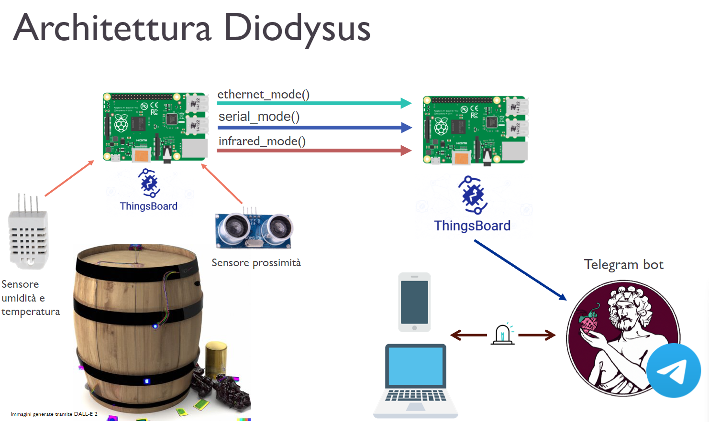
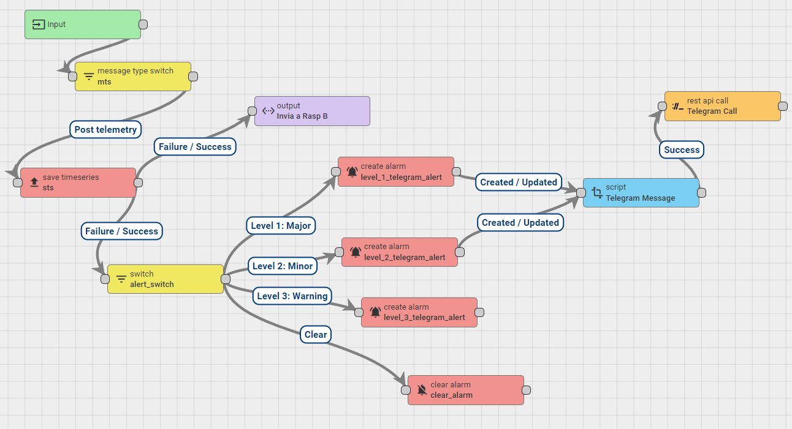
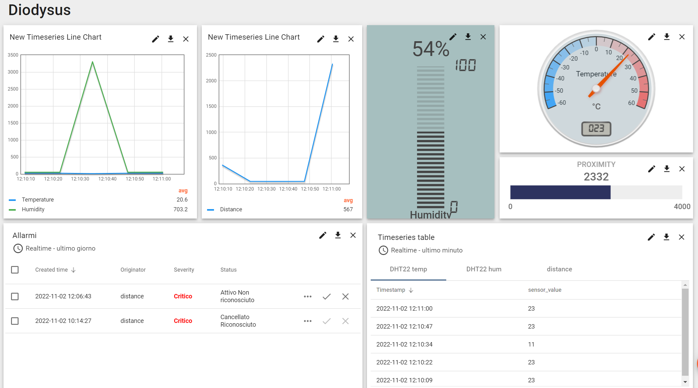

# Diodysus

## Diodysus - Smart Winery Secure System
### Introduzione
Con il processo di informatizzazione degli ultimi anni le reti tecnologiche all'interno di contesti industriali possono costituire la spina dorsale di un’impresa. Per questo motivo vi è un'urgente necessità globale di strumenti più efficaci per combattere le minacce informatiche e proteggere queste reti da attacchi che potrebbero causare gravi danni fisici, personali o finanziari. Esistono diverse tecnologie e procedimenti per aumentare il livello di sicurezza della rete anche se l’unico quasi certamente efficace è la separazione fisica. Tuttavia tale divisione non permetterebbe la raccolta di dati che possono essere troppo preziosi per essere scartati.  

Una soluzione intermedia potrebbe essere quella di implementare una comunicazione unidirezionale in modo da fornire una difesa di rete rafforzata e condividendo in modo sicuro i dati. Questo tipo di tecnologia è chiamato diodo dati. In questo modo la rete interna è totalmente inaccessibile e di conseguenza protetta dal mondo esterno. I diodi dati, in combinazione con altri strumenti, dispositivi, software e best practice di sicurezza informatica, aiutano gli utenti, gli operatori e i professionisti della sicurezza a ridurre i rischi per proteggere le proprie reti e i dati dalle minacce informatiche.  
Scenario
L’applicazione del diodo dati è stata pensata e sviluppata per uno scenario legato all’ambito  food&agriculture 4.0, ovvero quello della “smart winery”, che si occupa di migliorare l'attuale processo di produzione del vino tramite sistemi di sensoristica volti al monitoraggio in tempo reale dello stato delle botti di vino.   

Il nostro prototipo incorpora tre sensori: un DHT22 per misurare temperatura e umidità e un sensore ad ultrasuoni HC-SR04 per il calcolo della distanza. Questi monitorano il livello di vino all'interno della botte (il quale deve rientrare in un determinato intervallo), la temperatura ed infine l’umidità dell’ambiente, con il fine di garantire le migliori condizioni di produzione e una maggiore salute strutturale delle botti.  

Ciò consente ai viticoltori di monitorare in tempo reale lo stato di ogni botte di vino, in modo che in seguito ad un eventuale rilevamento di un problema questi possano agire immediatamente per risolverlo. Inoltre, se si registrano parametri anomali o condizioni ambientali errate è possibile grazie all’applicazione esserne a conoscenza quasi istantaneamente, in tal modo si può intervenire prima che il vino perda le qualità desiderate.  

## Architettura del diodo dati

# Thingsboard

## Rule Chain 

## Dashboard

## Info raspberry

Pi_a
- nome_host: raspberrypiA
- nome utente: pi_a
- password: AdminPi_a
- eth0: 192.168.10.11

-nome utente Postgres : postgres
-password Postgres : AdminPi_a

Pi_b
- nome_host: raspberrypiB
- nome utente: pi_b
- password: AdminPi_b
- eth0: 192.168.10.12

-nome utente Postgres : postgres
-password Postgres : AdminPi_b

