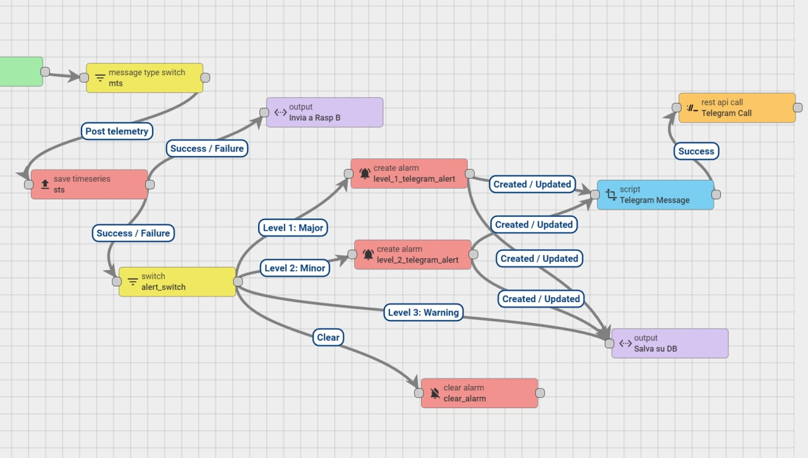

# Diodysus

## Info raspberry

Pi_a
- nome_host: raspberrypiA
- nome utente: pi_a
- password: AdminPi_a
- eth0: 192.168.10.11

-nome utente Postgres : postgres
-password Postgres : AdminPi_a

Pi_b
- nome_host: raspberrypiB
- nome utente: pi_b
- password: AdminPi_b
- eth0: 192.168.10.12

-nome utente Postgres : postgres
-password Postgres : AdminPi_b

CONNESSIONE DA REMOTO:

IP pubblico: 79.10.213.121  
SSH porta Pi_a: 2221  
SSH porta Pi_b: 2222   
Thingboard porta Pi_a: 8081  
Thingboard porta Pi_a: 8082  

ip_a interno: 192.168.1.15   
ip_b interno: 192.168.1.16  

ES: comando per collegarsi <ssh pi_a@79.10.213.121 -p 2221>

# Thingsboard

