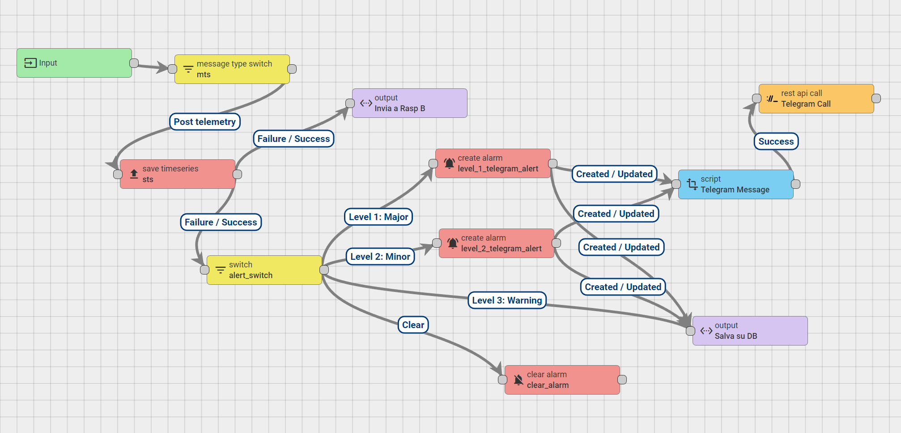

# Diodysus

## Architettura del diodo dati

# Thingsboard

## Rule Chain 

## Dashboard

## Info raspberry

Pi_a
- nome_host: raspberrypiA
- nome utente: pi_a
- password: AdminPi_a
- eth0: 192.168.10.11

-nome utente Postgres : postgres
-password Postgres : AdminPi_a

Pi_b
- nome_host: raspberrypiB
- nome utente: pi_b
- password: AdminPi_b
- eth0: 192.168.10.12

-nome utente Postgres : postgres
-password Postgres : AdminPi_b

